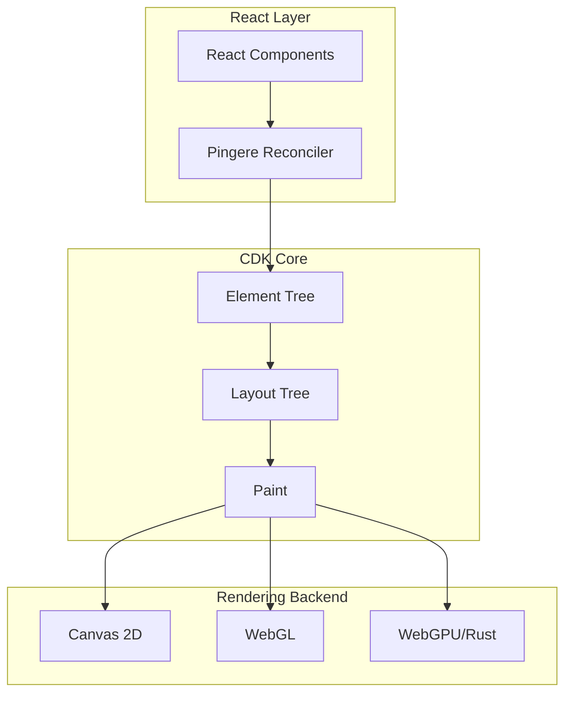

<!--
- [INPUT]: 依赖字节跳动内部 Layout-Box 代码库分析
- [OUTPUT]: 提供企业级 Canvas+Rust 渲染引擎的深度架构剖析
- [POS]: 位于 前端开发的历史与哲学/rdk 目录下的核心研报
- [PROTOCOL]: 变更时更新此头部，然后检查 CLAUDE.md
-->

# Layout-Box 项目分析报告

> 这是一个 **Canvas 渲染引擎 + React 集成框架** 的 Monorepo 项目，由字节跳动 Meego 团队开发，用于高性能的 Canvas UI 渲染。

---

## 📦 项目概览

| 项目属性     | 值                                    |
| ------------ | ------------------------------------- |
| **项目名称** | RDK Monorepo (layout-box)             |
| **包管理器** | Lerna + npm                           |
| **当前版本** | 1.3.19                                |
| **仓库地址** | code.byted.org/ies/layout-box         |
| **技术栈**   | TypeScript + React + Rust/WebAssembly |

---

## 🗂️ 项目架构

```
layout-box/
├── packages/                    # 核心包目录
│   ├── cdk/                     # Canvas Development Kit - 核心布局引擎
│   ├── cdk-dnd/                 # 拖拽能力库
│   ├── cdk-react/               # React 集成层
│   ├── cdk-view/                # 纯 JS 视图层
│   ├── collection/              # 虚拟滚动组件集合
│   ├── palouti/                 # Rust/Wasm 布局引擎
│   ├── pingere/                 # React Reconciler 渲染器
│   └── rdk/                     # Rust Drawing Kit - Rust 渲染核心
├── stories/                     # Storybook 示例
│   ├── dom-stories/
│   ├── gl-stories/
│   ├── pingere-stories/
│   ├── rdk-stories/
│   └── tutorial-stories/
├── island-docs/                 # Island.js 文档站点
└── .storybook/                  # Storybook 配置
```

---

## 📚 核心包详解

### 1. `@byted-meego/cdk` - Canvas Development Kit

**核心布局引擎**，提供基于 Canvas 的 UI 渲染能力。

| 模块                          | 描述                                                   |
| ----------------------------- | ------------------------------------------------------ |
| `CDK.ts`                      | 核心入口，管理渲染流程                                 |
| `src/components/`             | 基础组件 (Text, Image, Path, Fragment, ScrollFragment) |
| `src/foundation/Component.ts` | 组件基类                                               |
| `src/core/parser.ts`          | 布局解析器                                             |

**核心能力：**

- 组件树构建 (`createElementTree`, `createLayoutTree`)
- 布局计算 (`dimension`, `reflow`)
- 渲染绘制 (`paint`, `nativePaint`)
- 中间件系统 (`useMiddleware`)
- 样式系统 (Flexbox 布局)

```typescript
// 基础 API 示例
const cdk = CDK.create();
cdk.use(rootView);
const layout = cdk.build(widget);
cdk.paint(layout, contexts, activeSet, clipDimension);
```

---

### 2. `@byted-meego/pingere` - React 渲染器

基于 **React Reconciler** 实现的 Canvas 渲染器，让你可以用 JSX 语法编写 Canvas UI。

**核心能力：**

- React Fiber 架构集成
- JSX 组件映射到 CDK 组件
- 增量更新 (Incremental Rendering)
- 开发工具支持 (React DevTools)

```typescript
// JSX 语法使用示例
import { Stage, Text, Fragment, Image } from '@byted-meego/pingere';

const App = () => (
  <Stage width={800} height={600}>
    <Fragment style={{ flexDirection: 'row' }}>
      <Text>Hello Canvas!</Text>
      <Image src="..." />
    </Fragment>
  </Stage>
);
```

---

### 3. `@byted-meego/rdk` - Rust Drawing Kit

**Rust + WebAssembly** 实现的高性能渲染核心。

| 模块            | 描述                     |
| --------------- | ------------------------ |
| `core/`         | 组件、布局、渲染核心逻辑 |
| `renderer/`     | 渲染器抽象               |
| `wgpu/`         | WebGPU 渲染后端          |
| `glyph-brush/`  | 文字渲染                 |
| `region/`       | 区域管理                 |
| `web-bindings/` | Web 绑定层               |

**技术特点：**

- 使用 `wasm-pack` 编译为 WebAssembly
- 支持 WebGPU 硬件加速
- Lyon 库处理矢量图形
- 文字缓存与布局优化

---

### 4. `@byted-meego/cdk-dnd` - 拖拽库

为 Canvas 元素提供 **拖拽能力**。

**核心功能：**

- 拖拽源 (Draggable)
- 放置目标 (Droppable)
- 拖拽预览 (Preview)
- 自定义拖拽行为

```typescript
import { useDrag, useDrop } from '@byted-meego/cdk-dnd';

// 使用 React Hooks 风格的 API
const [{ isDragging }, drag] = useDrag({ ... });
const [{ isOver }, drop] = useDrop({ ... });
```

---

### 5. `@byted-meego/cdk-view` - 视图层

纯 JS 实现的视图管理层。

**核心模块：**

- `stage-view/` - 舞台视图管理
- `multi-grid/` - 多格子布局
- `damage/` - 脏区管理
- `middleware/` - 中间件系统

---

### 6. `@byted-meego/collection` - 虚拟滚动组件

高性能的**虚拟滚动**组件集合。

| 组件                | 描述             |
| ------------------- | ---------------- |
| `List`              | 一维列表虚拟滚动 |
| `Collection`        | 二维布局虚拟滚动 |
| `Grid`              | 网格虚拟滚动     |
| `ListingCollection` | 列表型集合       |
| `Scroll`            | 滚动容器         |

**特点：**

- 支持超大数据量 (20万+ 行)
- 动态行高/列宽
- 区域划分优化
- LRU 缓存机制

---

### 7. `@byted-meego/palouti` - Wasm 布局引擎

Rust 实现的布局计算引擎，编译为 WebAssembly 提供高性能布局能力。

---

## 🎯 设计理念

### 核心架构



### 渲染流程

1. **Build Phase**: JSX → Element Tree → Layout Tree
2. **Layout Phase**: 计算尺寸和位置 (Flexbox)
3. **Paint Phase**: 绘制到 Canvas
4. **Commit Phase**: 提交变更

---

## 🚀 使用示例

### 基础用法

```tsx
import { Stage, Fragment, Text, Image, List } from "@byted-meego/rdk-web";

const App = () => (
  <Stage width={600} height={600}>
    <List
      width={300}
      height={300}
      rowCount={200000}
      rowHeight={(index) => (index % 10) * 20 + 20}
      rowRenderer={({ index, style }) => (
        <Fragment style={{ ...style, backgroundColor: "red" }}>
          <Text>{index}</Text>
        </Fragment>
      )}
    />
  </Stage>
);
```

### RDK (Rust) 用法

```typescript
import { Stage, Fragment, Text } from '@byted-meego/rdk-react';

// RDK 提供更高性能的渲染
const HighPerfApp = () => (
  <Stage width={800} height={600} renderer="webgpu">
    <Fragment>
      <Text>High Performance Canvas</Text>
    </Fragment>
  </Stage>
);
```

---

## 📊 项目统计

| 指标            | 数值        |
| --------------- | ----------- |
| 包数量          | 9 个 npm 包 |
| Stories         | 49+ 个示例  |
| TypeScript 文件 | 200+        |
| Rust 文件       | 100+        |
| 代码行数        | 约 50,000+  |

---

## 🔧 开发命令

```bash
# 安装依赖
npm install

# 启动 Storybook
npm run storybook

# 启动文档站点
npm run island

# 构建 RDK (Rust)
cd packages/rdk && wasm-pack build --release --target web
```

---

## 📝 总结

**Layout-Box** 是一个企业级的 **Canvas 渲染框架**，具有以下特点：

1. **React 友好**: 通过 React Reconciler 提供 JSX 语法支持
2. **高性能**: Rust/WebAssembly 核心 + 虚拟滚动 + 脏区更新
3. **功能完整**: 布局、渲染、拖拽、滚动一体化方案
4. **可扩展**: 中间件系统、多渲染后端支持
5. **生产就绪**: 来自字节跳动 Meego 团队的内部实践

适用于需要**大规模数据可视化**、**复杂交互界面**、**高性能渲染**的前端场景，如甘特图、泳道图、表格等复杂 UI 组件。
