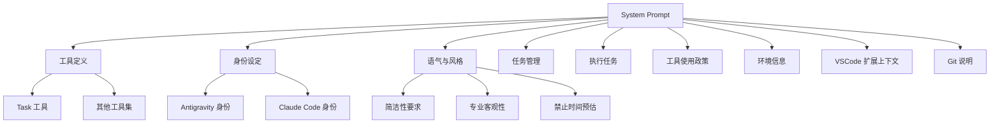
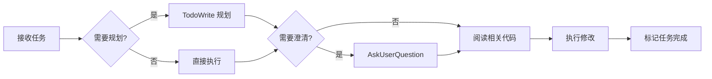

<!--
- [INPUT]: 依赖 system/CLAUDE.md 的模块定位与索引
- [OUTPUT]: 本文档提供 System Prompt 深度分析报告.md 的内容与知识
- [POS]: system/ 的知识文档 (L3)
- [PROTOCOL]: 变更时更新此头部，然后检查 CLAUDE.md
-->

# System Prompt 深度分析报告

> 分析对象：`complete_system_prompt.zh-CN.md`
> 分析时间：2026-01-27

---

## 一、文档整体架构



---

## 二、核心模块拆解

### 2.1 工具系统（Tools）

#### 2.1.1 双系统架构概览

Antigravity IDE 中存在两个独立的 AI 系统，各自拥有独立的工具集：

```
┌─────────────────────────────────────────────────────────────┐
│                      Antigravity IDE                        │
│                                                             │
│  ┌─────────────────────────┐  ┌─────────────────────────┐  │
│  │   Antigravity AI        │  │   Claude Code 插件      │  │
│  │                         │  │                         │  │
│  │  独有能力:              │  │  核心能力:              │  │
│  │  ★ generate_image       │  │  - Task (子代理)        │  │
│  │  ★ browser_subagent     │  │  - Bash                 │  │
│  │                         │  │  - Read/Edit/Write      │  │
│  │  基础能力:              │  │  - Grep/Glob            │  │
│  │  - run_command          │  │  - WebFetch/WebSearch   │  │
│  │  - view_file            │  │  - TodoWrite            │  │
│  │  - replace_file_content │  │  - AskUserQuestion      │  │
│  │  - search_web           │  │                         │  │
│  └─────────────────────────┘  └─────────────────────────┘  │
│                                                             │
│  两个系统互相独立，各自调用各自的工具，互不共享              │
└─────────────────────────────────────────────────────────────┘
```

> [!NOTE] 本报告分析的系统提示词来自 **Claude Code 插件**，而当前对话使用的是
> **Antigravity AI**。

---

#### 2.1.2 Claude Code 插件工具清单

| 工具名          | 类型       | 职责                   |
| --------------- | ---------- | ---------------------- |
| **Task**        | 代理调度器 | 启动子代理处理复杂任务 |
| TaskOutput      | 代理输出   | 子代理返回结果         |
| Bash            | 执行器     | Shell 命令执行         |
| Glob            | 搜索器     | 文件模式匹配           |
| Grep            | 搜索器     | 内容搜索               |
| Read            | 文件操作   | 读取文件内容           |
| Edit            | 文件操作   | 编辑文件内容           |
| Write           | 文件操作   | 创建/写入文件          |
| NotebookEdit    | 文件操作   | Jupyter Notebook 编辑  |
| WebFetch        | 网络工具   | 获取 URL 内容          |
| WebSearch       | 网络工具   | 网络搜索               |
| KillShell       | 执行器     | 终止 Shell 进程        |
| AskUserQuestion | 交互工具   | 向用户提问             |
| Skill           | 扩展工具   | 调用技能               |
| TodoWrite       | 任务管理   | 待办事项管理           |
| EnterPlanMode   | 模式切换   | 进入规划模式           |
| ExitPlanMode    | 模式切换   | 退出规划模式           |

---

#### 2.1.3 Antigravity 工具清单

| 工具名                     | 类型      | 职责                       |
| -------------------------- | --------- | -------------------------- |
| **browser_subagent** ★     | 视觉/交互 | 控制浏览器进行 UI 自动化   |
| **generate_image** ★       | 创作工具  | 基于文本生成或编辑图像     |
| search_web                 | 检索工具  | 执行互联网搜索获取实时资讯 |
| run_command                | 执行器    | 执行终端命令               |
| command_status             | 执行器    | 获取后台命令状态           |
| send_command_input         | 执行器    | 向命令发送输入/终止        |
| read_terminal              | 执行器    | 读取终端输出               |
| view_file                  | 文件操作  | 查看文件内容               |
| view_file_outline          | 文件操作  | 查看文件大纲               |
| view_code_item             | 文件操作  | 查看代码节点               |
| replace_file_content       | 文件操作  | 替换文件内容（单块）       |
| multi_replace_file_content | 文件操作  | 替换文件内容（多块）       |
| write_to_file              | 文件操作  | 创建/写入文件              |
| find_by_name               | 搜索器    | 按名称查找文件             |
| grep_search                | 搜索器    | 内容搜索                   |
| list_dir                   | 搜索器    | 列出目录内容               |
| read_url_content           | 网络工具  | 获取 URL 内容              |
| task_boundary              | 任务管理  | 任务边界管理               |
| notify_user                | 交互工具  | 通知用户/请求审批          |
| list_resources             | MCP 工具  | 列出 MCP 资源              |
| read_resource              | MCP 工具  | 读取 MCP 资源              |
| view_content_chunk         | 文档工具  | 查看文档分块               |

> ★ 标记为 Antigravity 独有的 AI 创作能力

**Antigravity 专有 AI 能力说明**：

1. **视觉与 UI 交互**: 通过 `browser_subagent`
   可观察并操作网页，实现前端调试、竞品分析或自动化测试
2. **多媒体生成**: `generate_image` 赋予快速构建原型、UI
   Mockup 或生成应用素材的能力
3. **互联网感知**: `search_web` 弥补预训练模型知识截止日期的限制
4. **工作流自动化**: 支持 `.agent/workflows` 规范，允许定义复杂的循环任务

---

#### 2.1.4 工具映射对照表

虽然两个系统独立运行，但在设计哲学上共享「工程任务原子操作」的理念：

| Claude Code 工具     | Antigravity 对应工具                        | 关系                 |
| -------------------- | ------------------------------------------- | -------------------- |
| `Task` (子代理)      | `browser_subagent`, `task_boundary`         | 功能重新设计         |
| `Bash`               | `run_command`, `send_command_input`         | 名称与接口重构       |
| `Grep`, `Glob`       | `grep_search`, `find_by_name`               | 名称与接口重构       |
| `Read`               | `view_file`, `view_file_outline`            | 拆分为更细粒度工具   |
| `Edit`               | `replace_file_content`, `multi_replace_...` | 拆分为更细粒度工具   |
| `Write`              | `write_to_file`                             | 名称与接口重构       |
| `TodoWrite`          | `task_boundary` + Artifact 系统             | 完全不同的任务系统   |
| `WebFetch/WebSearch` | `read_url_content`, `search_web`            | 名称与接口重构       |
| — (无)               | `generate_image`                            | **Antigravity 独有** |
| — (无)               | `browser_subagent`                          | **Antigravity 独有** |

---

#### 2.1.5 技术 FAQ

**Q: AI 在调用工具时会使用哪套工具？**

**只使用当前 AI 系统的工具。**
系统提示词中的工具描述仅是「语义蓝图」，类似于 API 文档。在运行时，AI 只能调用其环境实际注入的工具。

- Claude Code 插件 → 使用 Claude Code 工具（Task, Bash, Read 等）
- Antigravity AI → 使用 Antigravity 工具（run_command, view_file,
  generate_image 等）

---

**Q: 工具是如何对应上的？靠大模型判断吗？**

**不是靠模型判断，是运行时注入。**

1. **系统提示词中的工具描述** → 只是纯文本，帮助 AI 理解「意图」和「行为规范」
2. **实际工具** → 在 AI 启动时，由运行时「注入」到 AI 的可调用函数列表中

两者之间**没有映射过程**——提示词中的工具描述只是「参考读物」，注入的工具才是「实际接口」。

类比：你可以阅读 REST API 文档来理解概念，但实际调用时用的是 SDK 提供的函数。

---

**Q: 两个 AI 系统可以互相调用对方的工具吗？**

**不能。**
两个系统完全独立，各自拥有独立的工具集，互不共享。这也解释了为什么「声明的工具」和「实际的工具」不一样——它们本来就属于两个不同的系统。

> [!IMPORTANT] **核心结论**：Claude
> Code 系统提示词是其「语义蓝图」，Antigravity 有自己独立的工具链。两者在设计哲学上相似，但实现完全独立。

---

### 2.2 身份系统（Identity）

根据前文架构分析，Antigravity IDE 中存在两个独立的 AI 系统。在 Claude
Code 插件的系统提示词中，存在**双重身份声明**：

```
┌─────────────────────────────────────────────────────┐
│              Claude Code 插件身份声明              │
├─────────────────────────────────────────────────────┤
│  身份 1: Antigravity                               │
│  ├─ 来源: Google Deepmind                           │
│  └─ 定位: 强大代理式 AI 编程助手                     │
├─────────────────────────────────────────────────────┤
│  身份 2: Claude Code                               │
│  ├─ 来源: Anthropic 官方 CLI                        │
│  ├─ 运行环境: Claude Agent SDK                      │
│  └─ 模型: Sonnet 4.5 (claude-sonnet-4-5-20250929)   │
└─────────────────────────────────────────────────────┘
```

> [!NOTE] 这种双重身份声明可能是为了让 Claude Code 插件在 Antigravity
> IDE 环境中更好地融入，而非表示两者是同一个系统。

---

### 2.3 行为约束矩阵

#### 语气风格约束

| 规则         | 具体要求             |
| ------------ | -------------------- |
| 禁止表情符号 | 除非用户明确要求     |
| 输出简洁     | 适配命令行界面显示   |
| 格式化       | GitHub 风格 Markdown |
| 文件操作     | 优先编辑而非创建     |
| 工具调用     | 调用前不使用冒号     |

#### 专业客观性约束

| 维度         | 要求                         |
| ------------ | ---------------------------- |
| 技术准确性   | 优先于验证用户信念           |
| 反馈方式     | 直接、客观、无最高级词汇     |
| 不确定性处理 | 先调查真相，而非确认用户信念 |
| 禁止短语     | "你是完全正确的" 等夸张验证  |

#### 绝对禁止项

| 禁止行为      | 原因             |
| ------------- | ---------------- |
| 时间预估      | 避免误导用户预期 |
| 生成/猜测 URL | 安全考量         |
| Bash 用于交流 | 工具职责分离     |

---

### 2.4 任务执行规范

#### 执行流程



#### 代码修改原则

| 原则             | 说明                           |
| ---------------- | ------------------------------ |
| **先读后改**     | 绝不对未读代码提出修改建议     |
| **避免过度设计** | 仅做直接要求或明显必要的更改   |
| **安全优先**     | 避免 OWASP Top 10 漏洞         |
| **简洁聚焦**     | 不添加额外功能、重构或"改进"   |
| **删除彻底**     | 不使用向后兼容的技巧保留废代码 |

#### 反模式清单

> [!CAUTION] 以下行为被明确禁止：

- ❌ 为不会发生的情况添加错误处理
- ❌ 创建一次性操作的抽象/工具函数
- ❌ 为假设的未来需求设计
- ❌ 添加未修改代码的文档注释
- ❌ 使用功能开关或兼容垫片

---

### 2.5 工具使用策略

> [!NOTE] 以下策略来自 **Claude Code 插件** 的系统提示词，描述的是 Claude
> Code 的行为规范。

#### 优先级规则

1. **Task 代理优先**：文件搜索时使用 Task 减少上下文占用
2. **专用工具优先**：Read > cat, Edit > sed, Write > echo
3. **并行调用**：无依赖的工具调用应并行执行
4. **Explore 代理**：探索代码库时使用 `subagent_type=Explore`

#### 特殊处理

| 场景            | 处理方式                      |
| --------------- | ----------------------------- |
| WebFetch 重定向 | 立即使用重定向 URL 发起新请求 |
| 钩子反馈        | 视为来自用户的信息            |
| 被钩子阻塞      | 尝试调整操作或请用户检查配置  |

---

### 2.6 环境上下文

```yaml
运行环境:
  平台: darwin (macOS)
  IDE: VSCode 原生扩展
  模型: Claude Sonnet 4.5
  知识截止: 2025年1月

代码引用格式:
  文件: '[filename.ts](src/filename.ts)'
  行号: '[filename.ts:42](src/filename.ts#L42)'
  范围: '[filename.ts:42-51](src/filename.ts#L42-L51)'
```

---

## 三、设计哲学提炼

### 3.1 核心价值观

```
┌─────────────────────────────────────────────┐
│           PROMPT 设计哲学三角               │
│                                             │
│              专业客观性                      │
│                 ▲                           │
│                /│\                          │
│               / │ \                         │
│              /  │  \                        │
│             /   │   \                       │
│            /    │    \                      │
│           /     │     \                     │
│          ▼──────┴──────▼                    │
│       简洁高效      安全可控                 │
└─────────────────────────────────────────────┘
```

### 3.2 关键设计决策

| 决策           | 理由                                     |
| -------------- | ---------------------------------------- |
| 双重身份       | 兼容 Antigravity 与 Claude Code 两套系统 |
| 禁止时间预估   | AI 无法准确预测任务时间，避免锚定效应    |
| 先读后改       | 确保理解上下文，避免盲目修改             |
| 专用工具优先   | 提供更好的用户体验和错误处理             |
| TodoWrite 强制 | 防止复杂任务中遗漏步骤                   |

---

## 四、与标准 Claude System Prompt 的差异

| 维度     | 标准 Claude | 此 Prompt                        |
| -------- | ----------- | -------------------------------- |
| 工具系统 | 基础工具    | 多层代理系统 (Task + 子代理)     |
| 任务管理 | 无          | TodoWrite 强制使用               |
| 代码约束 | 通用        | 严格的"不过度设计"规范           |
| 时间预估 | 允许        | 明确禁止                         |
| 情感表达 | 允许        | 严格限制                         |
| 身份     | 单一        | 双重 (Antigravity + Claude Code) |

---

## 五、潜在优化建议

> [!TIP] 基于分析发现的改进空间：

1. **工具依赖图**：可添加工具间的依赖关系说明，帮助理解调用顺序
2. **错误恢复**：缺少工具调用失败时的恢复策略说明
3. **上下文管理**：未明确说明长对话中的上下文压缩策略
4. **跨系统协作**：未说明 Antigravity AI 与 Claude Code 插件是否有协作机制

---

## 六、文档元数据

| 属性             | 值                                      |
| ---------------- | --------------------------------------- |
| 原文件           | `prompts/system/完整系统提示词_中文.md` |
| Claude Code 工具 | 17 个                                   |
| Antigravity 工具 | 22 个                                   |
| 架构模式         | 双系统并行                              |
| 分析时间         | 2026-01-27                              |
